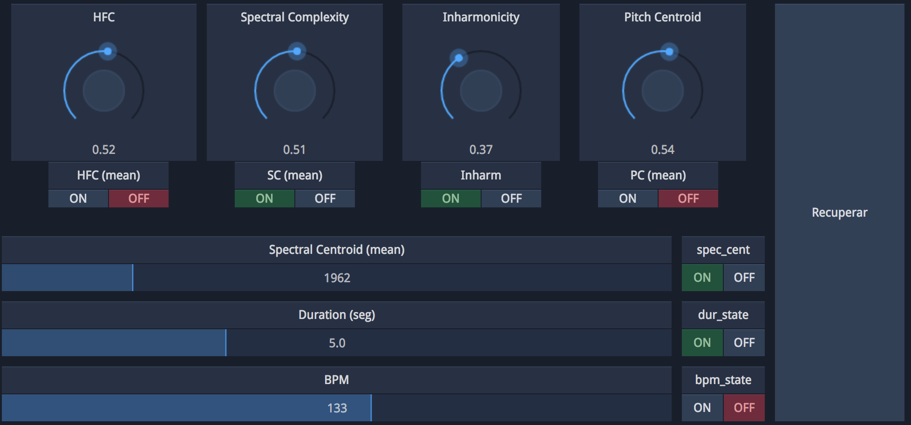

English version: [README.md](README.md)

# ¿Qué es?

ApiCultor fue implementado para realizar performances multidisciplinarias basadas en los sonidos de la plataforma [http://redpanal.org](http://redpanal.org) pero sirve para trabajar con cualquier otra base de datos sonora en internet o disponible localmente.

El código da soporte para el procesamiento de sonidos de la web utilizando técnicas de MIR (Music Information Retrieval) para la "extracción" de parámetros que los caractericen para luego clasficarlos, segmentarlos y manipularlos según los criterios elegidos.

Funciona a través de una API REST para la consulta externa de archivos y descriptores desde SuperCollider, pyo, pd o cualquier otro tipo de entorno que maneje protocolos estándar.

Extrae miel de [RedPanal](http://redpanal.org)  con técnicas de Music Information Retrieval (MIR).




## API

[Documentación sobre la API](doc/API.md)

## Sonidos Mutantes
*Sonidos Mutantes, propone performances basadas en el uso artístico de bases de datos preexistentes, las mismas construidas por audios o músicas libres, por ejemplo aquellas de la plataforma colaborativa de RedPanal.org, la cuál es de acceso público vía internet. Estos sonidos, analizados y procesados en tiempo real se combinan en una improvisación colectiva con músicos en vivo bajo consignas preestablecidas, dando lugar a composiciones que mutan a lo largo del tiempo y en función de los propios músicos y de la comunidad toda. Ya que el público podrá participar de la performance subiendo audios y haciendo búsquedas o comentarios en la plataforma web de RedPanal.*

### Pruebas de concepto:

* Performances en vivo utilizando estas herramientas:
  * Jam con guitarras + fx chain y sintes analógicos: [Perfo mutante en La Siesta del Fauno](https://soundcloud.com/hern-n-ordiales/perfo-mutante-mobile)
  * Cierre de Taller de Experimentación Sonora: [http://redpanal.org/a/banda-de-mutantes-cierre-taller/](http://redpanal.org/a/banda-de-mutantes-cierre-taller/)
  * La Noche de los Museos La Casa del Bicentenario 29/10/2016
[http://redpanal.org/a/performance-casa-tomada/](http://redpanal.org/a/performance-casa-tomada/)
  [https://www.youtube.com/watch?v=eKcvkgtJIEo](https://www.youtube.com/watch?v=eKcvkgtJIEo) Con visuales 3D (Blender + game engine) **Reseña**: [http://blog.enjambrelab.com.ar/enjambrebit-y-la-banda-de-mutantes/](http://blog.enjambrelab.com.ar/enjambrebit-y-la-banda-de-mutantes/)

* Música generativa con máquina de estados MIR y sonidos libres de Freesound.org: 
  * "[Feature Thinking](https://soundcloud.com/hern-n-ordiales/feature-thinking)" (con sonidos libres Creative Commons de Freesound.org)
  * State Machine @ CASo (Centro de Arte Sonoro) https://www.youtube.com/watch?v=sG1YUc8PQV4

* Remixes que toman audios libres de [RedPanal.org](http://redpanal.org/) para categorizarlos según diferentes tipos de emociones. Luego se elige una y se sincronizan las pistas, cambiando las tonalidades. De ser posible se separan de fuentes dentro de las mismas (by Mars Crop)
  * [Beats intro jazz](http://redpanal.org/a/sm-beats-remix/)
  * [Bass & DJ] (http://redpanal.org/a/sm-bass-guitar-plays-with-dj/)

* Demos viejas:
  * Integración con controlador MIDI + Supercollider + ApicultorWebService: [https://www.youtube.com/watch?v=X0M_gTOZnNQ](https://www.youtube.com/watch?v=X0M_gTOZnNQ)

## Componentes

* Mock web service que por medio de una API REST provee samples según criterios definidos por valores de descriptores MIR
* Máquina de estados según descriptores MIR
* Interacción con sonidos de [http://redpanal.org](http://redpanal.org)
 * API REST para realizar consultas sobre redpanal (url audios+valores de descriptores)
 * Webscrapping por tag
* Algoritmos MIR para extraer descriptores promedio o por frames de pistas o samples
* Algoritmos para segmentar los archivos de audio con diferentes criterios
* Algoritmos para clasificar y agrupar los archivos de la base de datos de [http://redpanal.org](http://redpanal.org) (clustering)
* Server OSC
* Ejemplos de uso con Supercollider, pyo
* Ejemplos con controladores MIDI y OSC. Locales y remotos.

Ver la [descripción de archivos](FILES_DESC.md) para más detalles.


# Dependencias

Tested under Linux, Mac OS (>10.11) and Windows 10.

Debian, Ubuntu 15.04 and 16.04 (and .10). And Docker images.
Raspian @ Raspberry Pi

Ver [INSTALL.md](INSTALL.md)


# Uso (estado experimental)

## Bajar los sonidos redpanaleros y aplicar MIR

```
$ cd apicultor/data 
$ ./download-test-data.sh # Predefinidos (testing)
$ python WebScrapingDownload.py <nombre_del_tag>
$ cd ..
$ python run_MIR_analysis.py <directorio_de_sonidos_del_tag>
```

## Segmentar sonidos

```
$ python RandomSegmentation.py
```

## Similaridad Sonora

Procesar señales de salida para guardar los sonidos en base a clusters

```
$ python SoundSimilarity.py carpetadeltag
```

## Sonificación

```
$ python Sonification.py carpetadeltag
```

## SuperCollider

Performance and helper scripts in "supercollider/".


## Correr webservice (requiere api rest)

```
$ python MockRedPanalAPI_service.py
```


By default:

* Listen IP: 0.0.0.0
* Port: 5000

Ver ejemplos de uso en tests/Test_API.py


## Generar documentación HTML sobre la API REST

```
$ cd doc/ && ./update_api_doc.sh
```

Resultado: API-Documentation.html


## Máquina de estados emocionales de la música (MusicEmotionMachine)

```
$ python MusicEmotionMachine.py directoriodondeestadata multitag
```

(True, clasifica Todos los audios descargados. Después de haber hecho la clasificación, correr de nuevo con la opcion multitag en False o en None para llamar a Johnny (la máquina de estados emocionales) para que comienzen las transiciones emocionales con remixes en tiempo real de Todos los sonidos)

En los remixes utilizamos, ademas de la data acerca de las correspondientes clases, las variables de decision en el entrenamiento del DSVM para reconstruir movimientos de scratching. Ademas se pone enfasis en la busqueda de componentes que se puedan separar (utilizando un metodo que intenta encontrar las n fuentes en una mezcla automaticamente) para generar remixes simples, donde el sonido puede marcar el ritmo y el sonido b puede seguir un rol harmonico. Nos proveemos de varias utilidades (métodos de scratching, segmentaciones, etc) para que el remix resulte divertido

### Sobre el aprendizaje profundo de la MEM:

Con la intención de obtener la mejor clasificación posible de los sonidos basándose en las emociones que son capaces de transmitirnos, la tarea profunda consiste en este caso particular de reveer las activaciones con capas de máquinas de soporte vectorial para dar con la clasificación correcta. Por el momento solamente se utilizan cuatro clases de emociones para la clasificación. Como la información del MIR es importante, el aprendizaje se hace respetando lo mejor posible las descripciones, lo que permite reveer las clasificaciones hechas hasta dar con las correctas. Es por esto que contamos con nuestros modulos de validación cruzada y con nuestras utilidades matemáticas para clasificar los sonidos sin perder información.
## Docker

Ver tutorial sobre [docker](docker.md) y [Dockerfile](Dockerfile).

Servicio (API) escuchando en puerto 5000:
```
$ docker build -t apicultor_v0.9 .
$ docker run -p 5000:5000 --name apicultor  -it --net="host"  apicultor_v0.9
```

## Build (TODO)


~~Si ya tenés instaladas todas las dependencias se puede correr: 
```
$ sudo python setup.py install
```
y tener Apicultor instalado en el sistema~~

